# GAUTAM JOSHI

`KillerB-O`

**DATA ENGINEERING · ANALYTICS · BACKEND**

 

  

<i>Turning data into systems.</i>

 

---

## GITHUB ANALYTICS

<picture>
  <source media="(prefers-color-scheme: dark)" srcset="./assets/overview.dark.svg">
  <source media="(prefers-color-scheme: light)" srcset="./assets/overview.light.svg">
  
</picture>

 

<picture>
  <source media="(prefers-color-scheme: dark)" srcset="./assets/contributions.dark.svg">
  <source media="(prefers-color-scheme: light)" srcset="./assets/contributions.light.svg">
  
</picture>

 

<picture>
  <source media="(prefers-color-scheme: dark)" srcset="./assets/composition.dark.svg">
  <source media="(prefers-color-scheme: light)" srcset="./assets/composition.light.svg">
  
</picture>

 

<picture>
  <source media="(prefers-color-scheme: dark)" srcset="./assets/rhythm.dark.svg">
  <source media="(prefers-color-scheme: light)" srcset="./assets/rhythm.light.svg">
  
</picture>

---

## LANGUAGE PROFILE

<picture>
  <source media="(prefers-color-scheme: dark)" srcset="./assets/languages.dark.svg">
  <source media="(prefers-color-scheme: light)" srcset="./assets/languages.light.svg">
  
</picture>

---

### CURRENTLY BUILDING

`ETL` · `DATA WAREHOUSING` · `POSTGRESQL` · `PYTHON`

 

